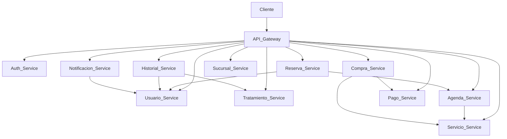

# 🏥 Cigna Project

<div align="center">

## Sistema de Gestión Clínica basado en Microservicios

Plataforma desarrollada con **Java 21** y **Spring Boot**, diseñada bajo una arquitectura de microservicios para gestionar usuarios, reservas, tratamientos, pagos, compras, sucursales y procesos clínicos de forma segura, modular y escalable.

<p>


</p>

</div>

---

# 📖 Descripción

**Cigna Project** es una plataforma clínica desarrollada utilizando una arquitectura de microservicios, donde cada dominio del negocio funciona como un servicio independiente.

El proyecto fue diseñado para aplicar buenas prácticas de desarrollo backend utilizando el ecosistema Spring, permitiendo una solución modular, mantenible y preparada para crecer mediante nuevos servicios.

La plataforma incorpora autenticación con JWT, documentación mediante Swagger/OpenAPI, migraciones automáticas con Liquibase, despliegue con Docker y persistencia independiente para cada microservicio.

---

# 🏗 Arquitectura



---

# 📦 Microservicios

| Microservicio | Descripción |
|---------------|-------------|
| 🌐 API Gateway | Punto único de entrada para todas las solicitudes del sistema. |
| 🔐 Auth Service | Autenticación y autorización mediante JWT. |
| 👤 Usuario Service | Gestión de usuarios. |
| 🩺 Servicio Service | Administración de servicios clínicos. |
| 💊 Tratamiento Service | Gestión de tratamientos médicos. |
| 📅 Agenda Service | Administración de agendas y disponibilidad. |
| 📋 Reserva Service | Gestión de reservas médicas. |
| 🛒 Compra Service | Administración de compras realizadas por los usuarios. |
| 💳 Pago Service | Procesamiento y gestión de pagos. |
| 📖 Historial Service | Administración del historial clínico. |
| 🏥 Sucursal Service | Gestión de sucursales. |
| 🔔 Notificación Service | Envío de notificaciones del sistema. |

---

# ⭐ Características

- ✅ Arquitectura basada en microservicios.
- ✅ API Gateway como punto de acceso centralizado.
- ✅ Seguridad mediante Spring Security y JWT.
- ✅ Comunicación entre microservicios mediante APIs REST.
- ✅ Documentación automática con Swagger/OpenAPI.
- ✅ Persistencia independiente para cada servicio.
- ✅ Migraciones de base de datos mediante Liquibase.
- ✅ Docker Compose para facilitar el despliegue local.
- ✅ Preparado para despliegues en Railway o Render.
- ✅ Tests automatizados y cobertura con JaCoCo.

---

# 🛠 Tecnologías

| Categoría | Tecnologías |
|-----------|-------------|
| Backend | Java 21 · Spring Boot |
| Seguridad | Spring Security · JWT |
| Persistencia | Spring Data JPA · Hibernate · MySQL |
| Documentación | Swagger / OpenAPI |
| Migraciones | Liquibase |
| Contenedores | Docker |
| Construcción | Maven |
| Testing | JUnit · JaCoCo |

---

# 📂 Estructura del proyecto

```text
Cigna/

├── api-gateway/
├── auth-service/
├── usuario-service/
├── servicio-service/
├── tratamiento-service/
├── agenda-service/
├── reserva-service/
├── compra-service/
├── pago-service/
├── historial-service/
├── sucursal-service/
├── notificacion-service/
│
├── docker-compose.yml
└── README.md
```

---

# 📚 Documentación

Cada microservicio cuenta con su propio **README** con información detallada sobre:

- 📋 Descripción
- 🔄 Responsabilidades
- 🌐 Endpoints REST
- 📚 Swagger UI
- ⚙️ Variables de entorno
- 🐳 Docker
- ☁️ Despliegue
- 🧪 Ejecución de tests
- 📈 Cobertura de código

---

# 📸 Capturas

Próximamente se incorporarán capturas de:

- 📚 Swagger UI
- 🐳 Docker Compose
- 📮 Colección Postman
- 🗄️ Base de datos
- 🏥 Arquitectura del sistema

---

# 🎯 Objetivos del proyecto

- Implementar una arquitectura moderna basada en microservicios.
- Aplicar buenas prácticas de desarrollo con Spring Boot.
- Proteger los servicios mediante autenticación JWT.
- Facilitar el despliegue utilizando Docker.
- Mantener una documentación independiente para cada servicio.
- Desarrollar una solución escalable y preparada para futuras funcionalidades.

---

<div align="center">

## 💙 Cigna Project

### Arquitectura • Seguridad • Escalabilidad • Microservicios

Desarrollado con ❤️ utilizando el ecosistema Spring.

</div>
