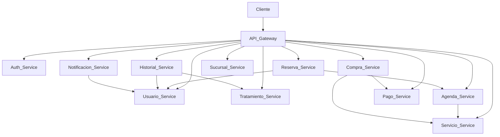

# 🏥 Cigna Project

<p align="center">

# Sistema de Gestión Clínica basado en Microservicios

Arquitectura distribuida desarrollada con **Java 21**, **Spring Boot** y **Spring Cloud**, diseñada para administrar procesos clínicos mediante una arquitectura de microservicios desacoplados.

</p>

---

# 🚀 Tecnologías utilizadas

<p align="center">


</p>

---

# 📖 Descripción

**Cigna Project** es una plataforma desarrollada bajo una arquitectura de microservicios para gestionar procesos clínicos de forma escalable y desacoplada.

Cada dominio de negocio funciona como un servicio independiente, permitiendo una mejor mantenibilidad, escalabilidad y comunicación entre componentes.

El proyecto incorpora autenticación mediante JWT, API Gateway, Eureka Discovery Server, documentación con Swagger, migraciones con Liquibase y despliegue mediante Docker.

---

# 🏗 Arquitectura



---

# 📦 Microservicios

| Microservicio | Descripción |
|--------------|-------------|
| 🔍 Discovery Server | Registro y descubrimiento de servicios mediante Eureka. |
| 🌐 API Gateway | Punto único de acceso para todos los microservicios. |
| 🔐 Auth Service | Autenticación y autorización mediante JWT. |
| 👤 Usuario Service | Gestión de usuarios del sistema. |
| 🩺 Servicio Service | Administración de servicios clínicos. |
| 💊 Tratamiento Service | Gestión de tratamientos médicos. |
| 📅 Agenda Service | Administración de agendas médicas. |
| 📋 Reserva Service | Gestión de reservas de atención. |
| 🛒 Compra Service | Administración de compras realizadas por usuarios. |
| 💳 Pago Service | Procesamiento de pagos. |
| 📖 Historial Service | Gestión del historial clínico. |
| 🏥 Sucursal Service | Administración de sucursales. |
| 🔔 Notificación Service | Envío de notificaciones del sistema. |

---

# ⭐ Características

- Arquitectura basada en microservicios.
- API Gateway como punto único de acceso.
- Service Discovery mediante Eureka.
- Autenticación con JWT y Spring Security.
- Comunicación REST entre microservicios.
- Documentación con Swagger/OpenAPI.
- Persistencia independiente por servicio.
- Migraciones automáticas mediante Liquibase.
- Contenedorización con Docker.
- Maven como herramienta de construcción.
- Preparado para despliegue en Railway o Render.

---

# 🗂 Estructura del proyecto

```text
cigna/

├── README.md
│
├── discovery-server/
├── api-gateway/
│
├── auth-service/
├── usuario-service/
├── servicio-service/
├── tratamiento-service/
├── agenda-service/
├── reserva-service/
├── compra-service/
├── pago-service/
├── historial-service/
├── sucursal-service/
├── notificacion-service/
│
└── docs/
```

---

# 📷 Capturas

Próximamente se incorporarán capturas de:

- 📊 Eureka Dashboard
- 📚 Swagger UI
- 🐳 Docker Compose
- 📮 Colección Postman
- 🗄️ Bases de datos

---

# 🚀 Inicio rápido

Cada microservicio cuenta con su propia documentación técnica (`README.md`), donde encontrarás:

- 📋 Descripción del servicio
- 🔄 Comunicación con otros microservicios
- 🌐 Endpoints REST
- 📚 Swagger UI
- ⚙️ Variables de entorno
- 🐳 Ejecución con Docker
- ☁️ Despliegue en Railway/Render
- ✅ Tests y cobertura

---

# 👥 Equipo

Proyecto desarrollado por el equipo **Cigna Project** como una solución académica orientada a la implementación de una arquitectura de microservicios utilizando el ecosistema Spring.

---

# 📄 Licencia

Este proyecto fue desarrollado con fines académicos.
