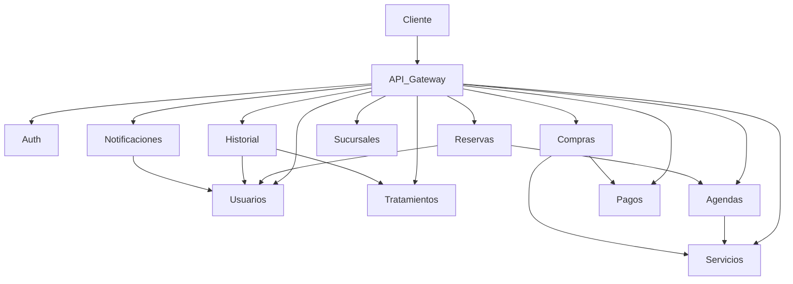

# 🏥 Cigna Project

<div align="center">

## Sistema de Gestión Clínica basado en Microservicios

Arquitectura distribuida desarrollada con **Java 21**, **Spring Boot** y **Spring Cloud**, diseñada para ofrecer una plataforma escalable, segura y modular para la administración de procesos clínicos.

<p>


</p>

</div>

---

# 📖 Descripción

**Cigna Project** es una plataforma clínica desarrollada bajo una arquitectura de microservicios, donde cada dominio del negocio opera de manera independiente para facilitar la escalabilidad, el mantenimiento y la evolución del sistema.

La solución incorpora autenticación mediante JWT, comunicación entre servicios, documentación automática con Swagger/OpenAPI, migraciones con Liquibase y despliegue mediante Docker.

---

# 🏗 Arquitectura General



---

# 🚀 Componentes principales

| Componente          | Función                                                               |
| ------------------- | --------------------------------------------------------------------- |
| 🌐 API Gateway      | Punto único de acceso para todas las peticiones.                      |
| 🔍 Discovery Server | Registro y descubrimiento dinámico de microservicios mediante Eureka. |
| 🔐 Auth Service     | Autenticación y autorización mediante JWT.                            |

---

# 📦 Ecosistema de Microservicios

| Servicio                | Descripción                                     |
| ----------------------- | ----------------------------------------------- |
| 👤 Usuario Service      | Administración de usuarios del sistema.         |
| 🩺 Servicio Service     | Gestión de servicios clínicos.                  |
| 💊 Tratamiento Service  | Administración de tratamientos médicos.         |
| 📅 Agenda Service       | Gestión de disponibilidad y agendas.            |
| 📋 Reserva Service      | Administración de reservas.                     |
| 🛒 Compra Service       | Gestión de compras realizadas por los usuarios. |
| 💳 Pago Service         | Procesamiento de pagos asociados a compras.     |
| 📖 Historial Service    | Administración del historial clínico.           |
| 🏥 Sucursal Service     | Gestión de sucursales.                          |
| 🔔 Notificación Service | Envío de notificaciones a los usuarios.         |

---

# ⭐ Características

* ✅ Arquitectura basada en microservicios.
* ✅ API Gateway como punto de entrada.
* ✅ Eureka Discovery Server.
* ✅ Spring Security + JWT.
* ✅ Comunicación REST entre servicios.
* ✅ Swagger/OpenAPI en cada microservicio.
* ✅ Migraciones automáticas con Liquibase.
* ✅ Persistencia independiente por servicio.
* ✅ Docker Compose para despliegue local.
* ✅ Preparado para despliegues en Railway/Render.
* ✅ Tests automatizados y cobertura mediante JaCoCo.

---

# 🛠 Stack Tecnológico

| Categoría      | Tecnologías            |
| -------------- | ---------------------- |
| Backend        | Java 21, Spring Boot   |
| Microservicios | Spring Cloud, Eureka   |
| Seguridad      | Spring Security, JWT   |
| Persistencia   | MySQL, Spring Data JPA |
| Migraciones    | Liquibase              |
| Documentación  | Swagger / OpenAPI      |
| Contenedores   | Docker                 |
| Construcción   | Maven                  |

---

# 📂 Organización del proyecto

```text
Cigna/
│
├── discovery-server/
├── api-gateway/
│
├── auth-service/
├── usuario-service/
├── servicio-service/
├── tratamiento-service/
├── agenda-service/
├── reserva-service/
├── compra-service/
├── pago-service/
├── historial-service/
├── sucursal-service/
├── notificacion-service/
│
├── docker-compose.yml
└── README.md
```

---

# 📚 Documentación

Cada microservicio posee un **README** propio con información detallada sobre:

* Descripción
* Responsabilidades
* Comunicación con otros servicios
* Endpoints REST
* Swagger UI
* Variables de entorno
* Docker
* Despliegue
* Ejecución local
* Tests

---

# 📷 Capturas

Próximamente se incorporarán imágenes de:

* 📊 Eureka Dashboard
* 📚 Swagger UI
* 🐳 Docker Compose
* 📮 Colección Postman
* 🗄️ Bases de datos

---

# 🚀 Objetivos del proyecto

* Implementar una arquitectura desacoplada basada en microservicios.
* Aplicar buenas prácticas de desarrollo backend con Spring.
* Gestionar autenticación segura mediante JWT.
* Facilitar el despliegue mediante Docker.
* Mantener documentación técnica independiente por servicio.
* Simular una plataforma clínica moderna preparada para escalar.

---

<div align="center">

## 💙 Cigna Project

**Arquitectura moderna • Microservicios • Seguridad • Escalabilidad**

</div>
