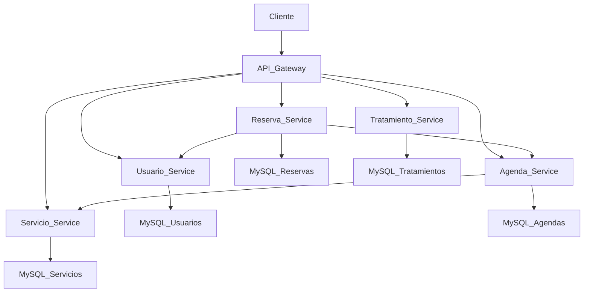

# 🏥 Cigna Project

<p align="center">

# Sistema de Gestión Clínica basado en Microservicios

Arquitectura distribuida desarrollada con **Java 21** y **Spring Boot**, orientada a la administración de usuarios, servicios médicos, agendas, reservas y tratamientos.

</p>

---

## 🚀 Tecnologías utilizadas

<p align="center">


</p>

---

# 📖 Descripción

**Cigna Project** es una plataforma desarrollada bajo una arquitectura de microservicios para gestionar procesos clínicos.

Cada dominio de negocio se encuentra desacoplado en un servicio independiente, permitiendo una arquitectura escalable, mantenible y preparada para futuras integraciones.

El proyecto fue desarrollado como una solución académica aplicando buenas prácticas de desarrollo backend, comunicación entre servicios y gestión independiente de bases de datos.

---

# 🏗 Arquitectura



---

# 📦 Microservicios

| Microservicio       | Descripción                                             |
| ------------------- | ------------------------------------------------------- |
| Discovery Server    | Registro y descubrimiento de servicios mediante Eureka. |
| API Gateway         | Punto único de acceso para todos los microservicios.    |
| Usuario Service     | Administración de usuarios del sistema.                 |
| Servicio Service    | Gestión de servicios clínicos disponibles.              |
| Agenda Service      | Administración de agendas médicas y disponibilidad.     |
| Reserva Service     | Gestión de reservas realizadas por los usuarios.        |
| Tratamiento Service | Administración de tratamientos clínicos.                |

---

# ⭐ Características

* Arquitectura basada en microservicios.
* Comunicación entre servicios mediante Spring Cloud.
* API Gateway como punto de entrada.
* Service Discovery con Eureka.
* Persistencia independiente por microservicio.
* Gestión de migraciones con Liquibase.
* APIs REST.
* Maven como herramienta de construcción.
* Bases de datos MySQL independientes.

---

# 🗂 Estructura del proyecto

```text
cigna/

├── README.md
├── cigna-nuevo/
│   ├── discovery-server/
│   ├── api-gateway/
│   ├── usuario-service/
│   ├── servicio-service/
│   ├── agenda-service/
│   ├── reserva-service/
│   ├── tratamiento-service/
│   └── README.md
```

---

# 📷 Capturas

Próximamente se incorporarán capturas de:

* Eureka Dashboard
* Swagger UI
* Postman Collection
* Base de datos

---

# 🚀 Inicio rápido

La documentación técnica completa para instalar y ejecutar el proyecto se encuentra en:

```text
cigna-nuevo/README.md
```

Allí encontrarás:

* Requisitos
* Configuración
* Orden de ejecución
* Liquibase
* Endpoints
* Bases de datos
* Guía para desarrolladores

---

# 👥 Equipo

Proyecto desarrollado por el equipo **Cigna Project** como parte del desarrollo de una plataforma clínica basada en microservicios.

---

# 📄 Licencia

Este proyecto fue desarrollado con fines académicos.
